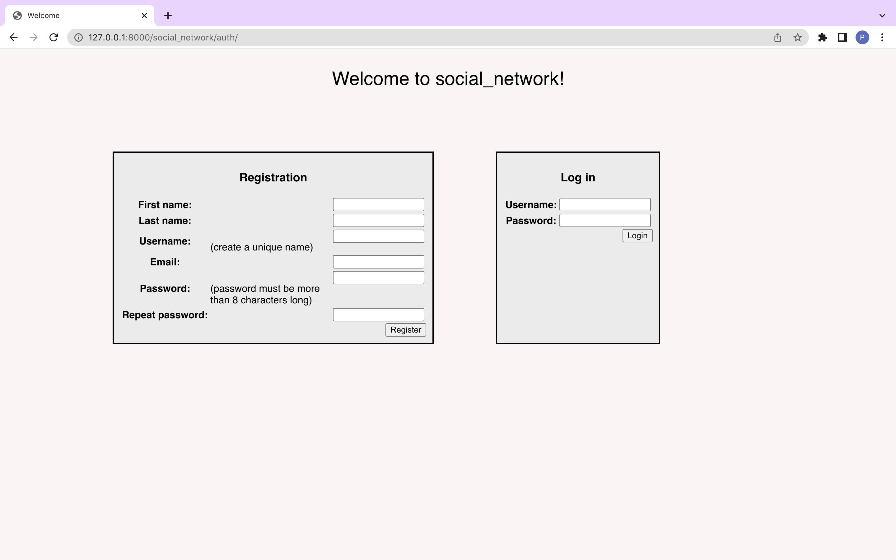
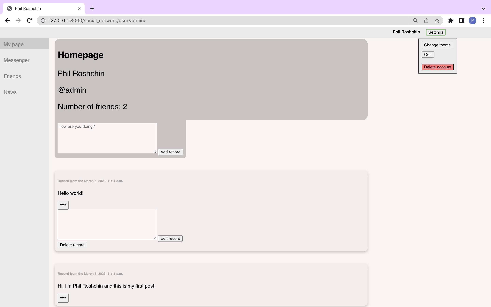
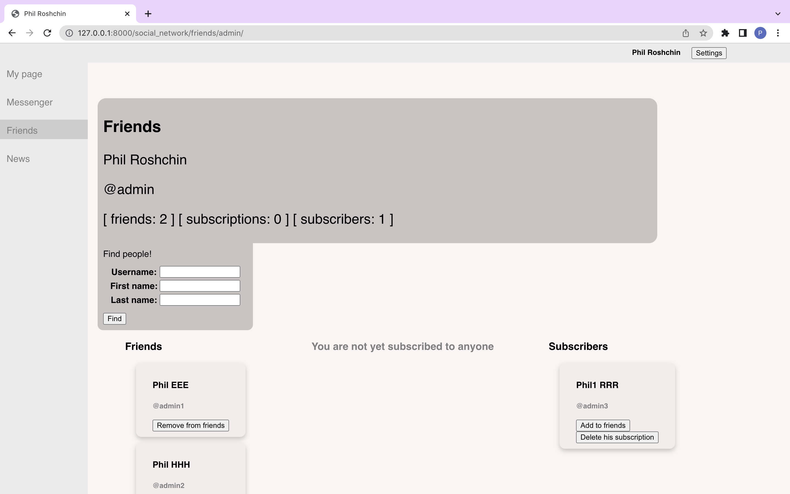
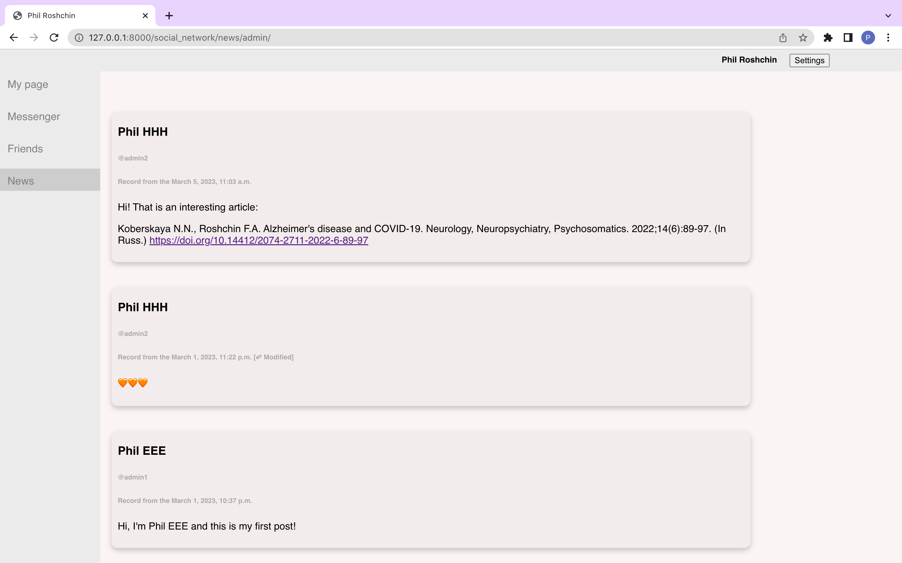
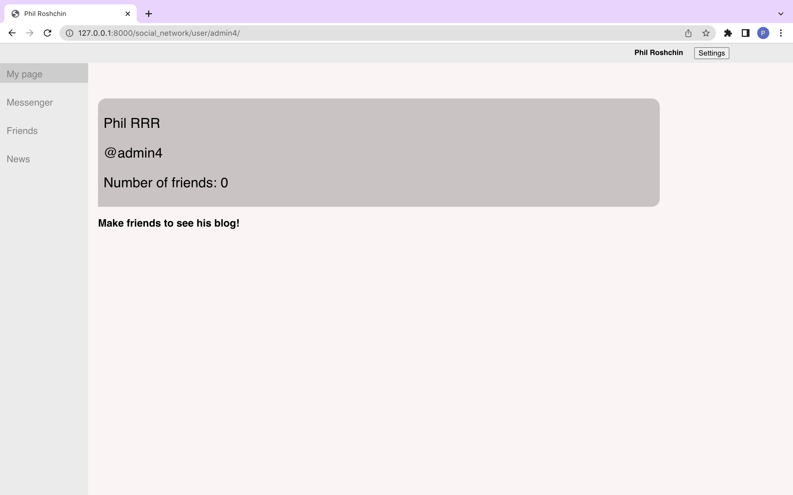

# social_network

Hi! This is my second Django project. This time I wrote a mini-social network.

This app supports accounts and adding friends. Each user has the opportunity to maintain their own blog, subscribe to other people and see their blogs.

At the moment I have not implemented the messenger, but in the near future I will write one.

Have fun!

