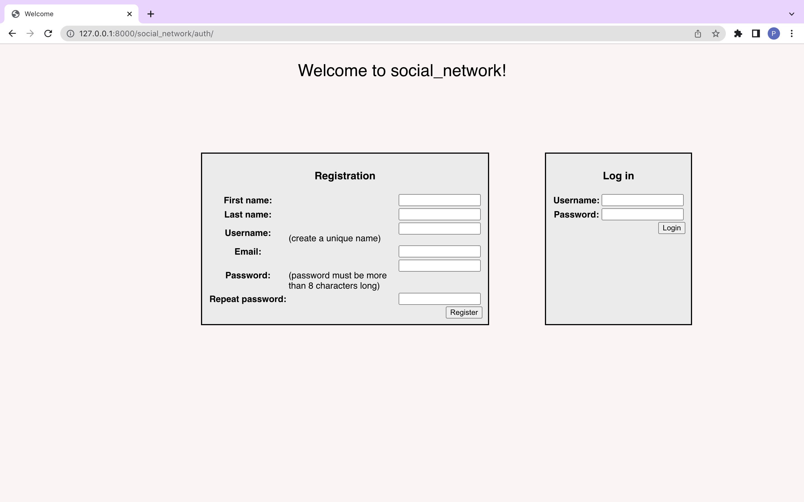
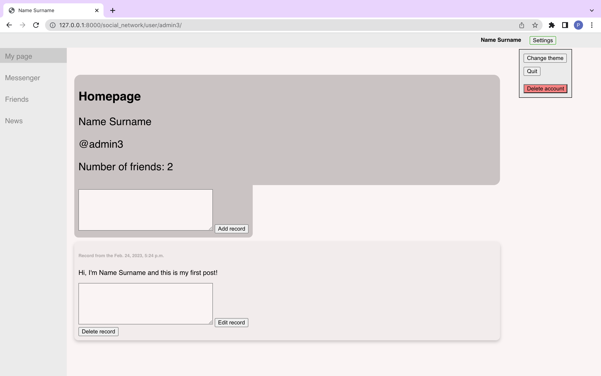
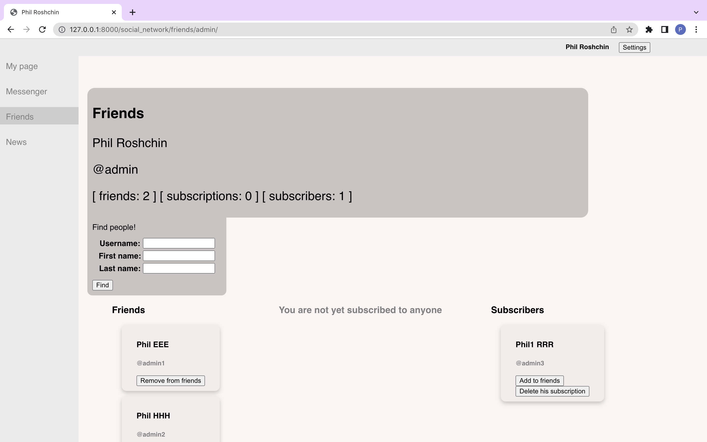
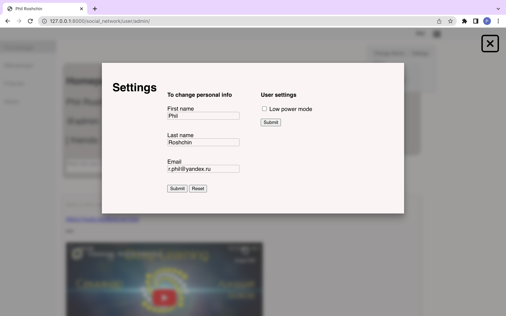
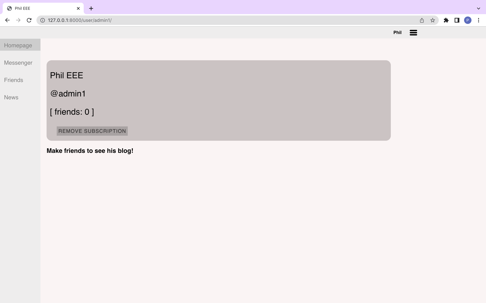
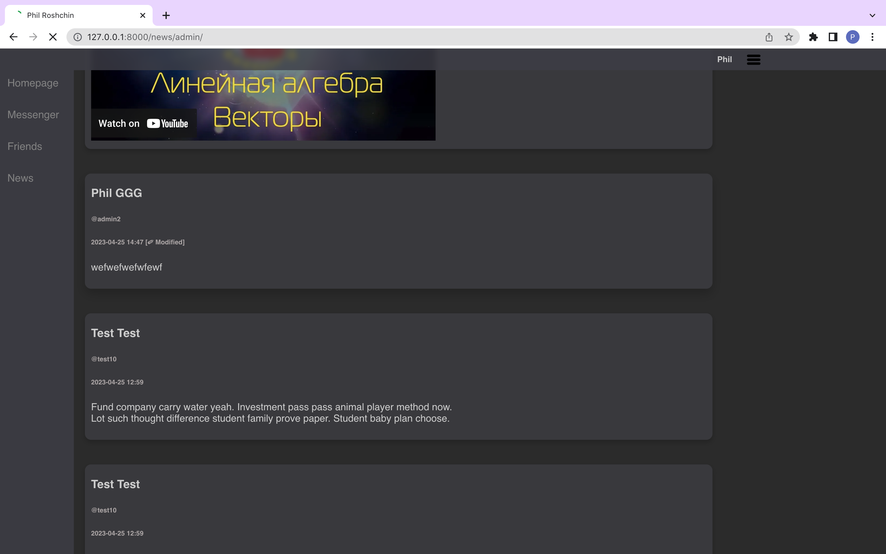
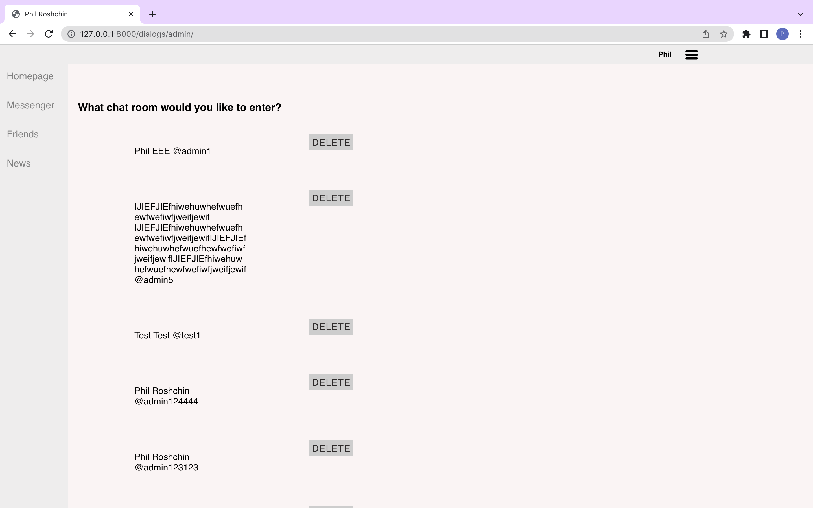
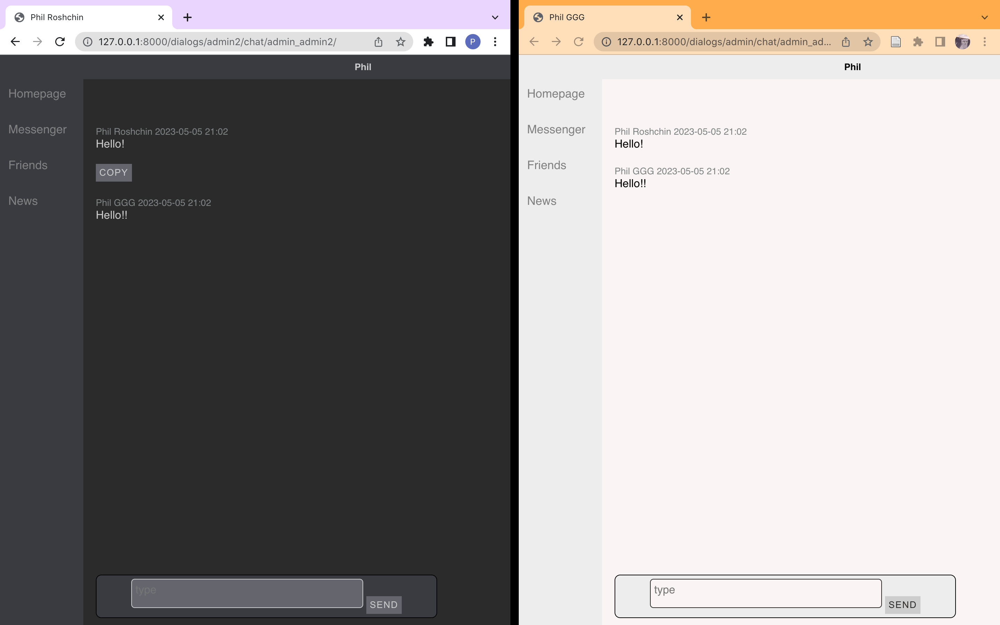

# social_network

Hi! This is my second Django project. This time I wrote a mini-social network!

## What supports this app
1. This app supports accounts and adding friends. Each user has the opportunity to maintain their own blog, subscribe to other people and see their blogs.

2. And recently it became possible to correspond between friends!

3. If you embed a share link to a YouTube video in a post, the post automatically embeds the YouTube `iframe` of that video. This function can be disabled without any problems if you tick the `low power mode button` in the settings.

4. Meet the dark theme!


\
To run the app use ```hypercorn social_network.asgi:application```

\
Have fun and if you want please leave feedback!


## Photos












## Technologies used:

### 1) django-channels
-- Django channels documentation https://channels.readthedocs.io/en/stable/index.html
```console
pip install channels
```

### 2) hypercorn
-- ASGI and WSGI web server
```console
pip install hypercorn
```
-- for running the server call `hypercorn social_network.asgi:application`

### 3) AJAX

### 4) See requirements.txt for more information